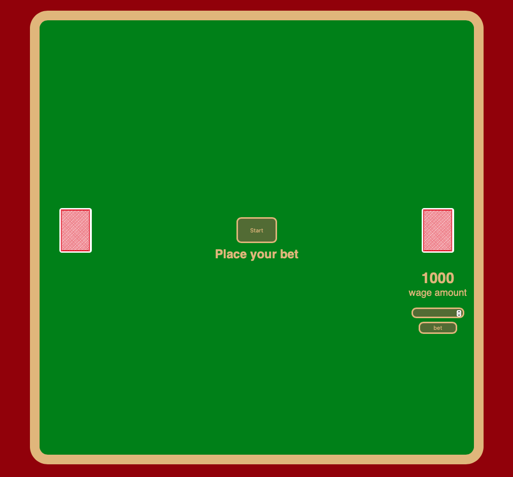
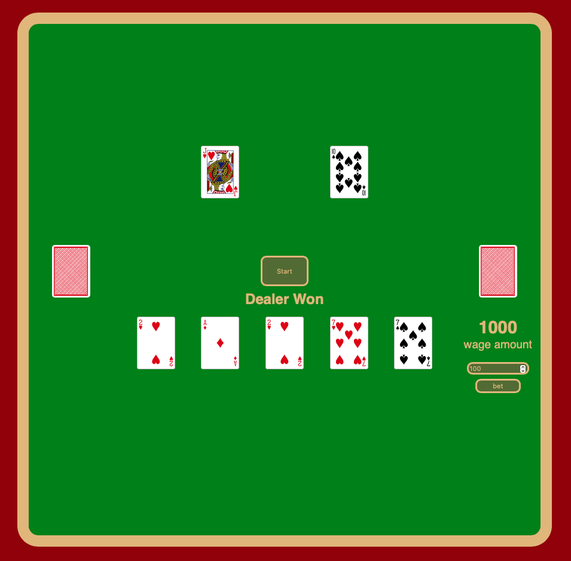

# Black Jack
A simple black Jack game.
The game consists of one deck with 52 cards shuffled. 
Two cards are dealt to the player and dealer.
The goal of the game is to get to 21 or having more than the dealer. 
Hitting will deal another card to the player.
Stand will finish player’s turn. 

# Screenshot

# Techologies Used
- Javascript
- HTML  
- CSS
- CardStarter CSS Library
- Grid/Flex Box

# Getting Started

[Click to play Black Jack](https://will-jian.github.io/BlackJack/)

# Next Steps
- Deal card animation with delay
- Spliting hands